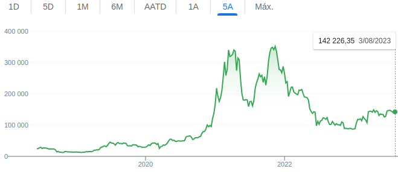

# Projeto Final - Python for Data Engineer 🐍

Repositório do projeto final da disciplina de Python for Data Engineer do MBA em Data Engineering da faculdade Impacta.

- [Projeto Final - Python for Data Engineer 🐍](#projeto-final---python-for-data-engineer-)
  - [Objetivo](#objetivo)
  - [Requisitos](#requisitos)
  - [Ingestão de dados](#ingestão-de-dados)
    - [Sobre](#sobre)
    - [Como usar](#como-usar)
  - [Detalhes técnicos](#detalhes-técnicos)
  - [Licença](#licença)

## Objetivo

O objetivo deste projeto é complementar o conhecimento técnico obtido ao longo desta disciplina em um projeto de engenharia e análise de dados que envolve ingestão, armazenamento e análise de dados.

## Requisitos

- **Ingestão de dados**: Construir uma aplicação que ingere dados do CoinMarketCap, os transforma e os carrega em um armazenamento de dados.
- **Modelagem de dados e design de banco de dados**: Construir um modelo de dados e projetar um esquema de banco de dados para o armazenamento.
- **Análise de dados**:
Crie gráficos de apresentação de dados que respondam às seguintes perguntas:
  - O preço do Bitcoin nos últimos 5 anos. Utilize a figura 1 como exemplo.
  - Gráfico do tipo candlestick nos últimos 30 dias do Bitcoin. Utilize a figura 2 como exemplo.

||
|:--:|
| Figura 1 |
||
| Figura 2 |

## Ingestão de dados

### Sobre

A aplicação de ingestão de dados foi desenvolvida utilizando a linguagem Python e a biblioteca ???. O objetivo da aplicação é extrair dados do site CoinMarketCap e armazená-los em um banco de dados ????.

### Como usar

1. Clone o repositório para a sua máquina local:

```bash
git clone 
```

2. Instale as dependências:

```bash
cd projeto-final-python-for-data-engineer
pip install -r requirements.txt
```

## Detalhes técnicos

Area reservada para detalhes técnicos do projeto.

## Licença

[MIT License](/LICENSE)
